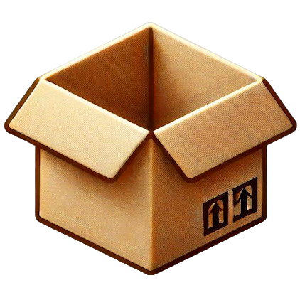
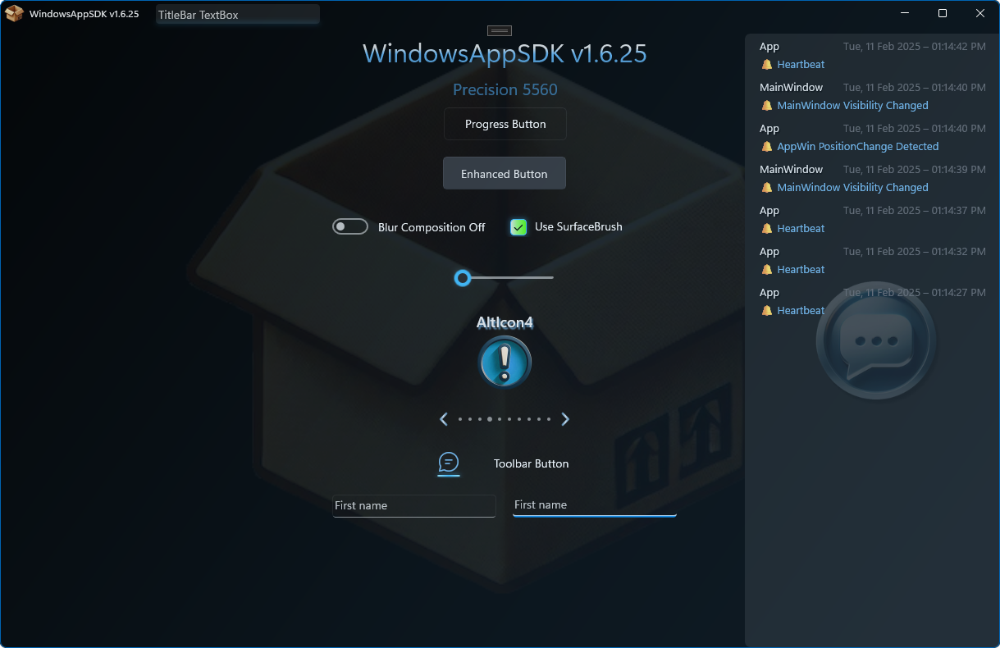

# WinUI - UI Demo SDK v1.6.x

## 📝 v1.0.0.0 - January 2025

**Dependencies**

| Assembly | Version |
| ---- | ---- |
| .NET Core | 8.0.11 |
| Microsoft.WindowsAppSDK | 1.6.250228001 |
| Microsoft.Windows.SDK.BuildTools | 10.0.26100.1742 |

## 🎛️ Description
- A test application for changes and updates made to the [WindowsAppSDK](https://learn.microsoft.com/en-us/windows/apps/windows-app-sdk/stable-channel).
- [WinUI 3](https://github.com/Microsoft/microsoft-ui-xaml) is the effort to lift official native Microsoft UI controls and features out of the operating system, so app developers can use the latest controls and visuals on any in-market version of the OS. C#/WinRT is needed to support the changes required for lifting the XAML APIs out of Windows.UI.XAML and into Microsoft.UI.XAML.
- I've added code examples for customizing `Microsoft.UI.Xaml.Controls.ContentDialog`, `Windows.UI.StartScreen.JumpList`, `Windows.ApplicationModel.Activation`, `Microsoft.UI.Windowing.AppWindow` and `Microsoft.UI.Windowing.DisplayArea` management, and creating gradient window backdrops via `Microsoft.UI.Composition.SpriteVisual`. The blur effects are created from scratch without the use of any 3rd party NuGets.
- This source also contains plenty of tips and tricks for any application, including but not limited to: Compositor, TaskBar, PubSub, Toast, Channels, DispatcherQueue, Image Capture, Split View, Profile Settings, Machine Environment, Binding, Stylers, Converters, P/Invoke, Extensions, et al.
- There's a hidden surprise if you're watching the `SplitView` PubSub message queue while **CapsLock** is on.
- Don't forget to give a ⭐ if you find any of my code helpful or educational.

## 💻 Screenshots

> Main Page

> Content Dialog

> Compositor Blur

> BitmapImage vs SoftwareBitmap

> JumpList

> Vertical Menu

> Custom Button Effects

> Home-brew Graph control

## 🧾 License/Warranty
* Permission is hereby granted, free of charge, to any person obtaining a copy of this software and associated documentation files (the "Software"), to deal in the Software without restriction, including without limitation the rights to use, copy, modify, merge, publish and distribute copies of the Software, and to permit persons to whom the Software is furnished to do so, subject to the following conditions: The above copyright notice and this permission notice shall be included in all copies or substantial portions of the Software.
* The software is provided "as is", without warranty of any kind, express or implied, including but not limited to the warranties of merchantability, fitness for a particular purpose and noninfringement. In no event shall the author or copyright holder be liable for any claim, damages or other liability, whether in an action of contract, tort or otherwise, arising from, out of or in connection with the software or the use or other dealings in the software.
* Copyright © 2023-2025. All rights reserved.

## 📋 Proofing
* This application was compiled and tested using *VisualStudio* 2022 on *Windows 10* versions **22H2**, **21H2**, **21H1** and *Windows 11* versions **24H2**, **23H2**.
